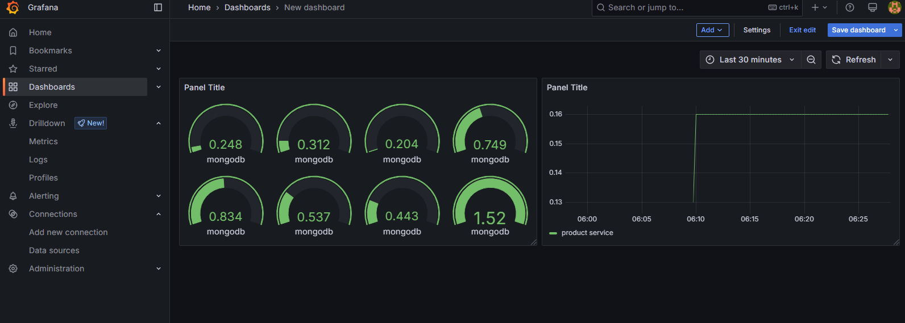

# 🛍️ Full-Stack eCommerce Website (MERN Stack)

This is a full-featured eCommerce platform built with the **MERN stack** (MongoDB, Express.js, React, Node.js). The app allows users to browse and purchase products, while admins can manage the catalog, view orders, and handle user accounts.

---

## 🚀 Features

### ✅ User Authentication & Authorization
- JWT-based user authentication.
- Role-based access for Admin and regular users.
- Profile view and update for authenticated users.

### 🛒 Product Catalog
- Browse products with images, descriptions, prices, and ratings.
- Filter products by category, price, and rating.
- Detailed product pages with stock availability and user reviews.
- Pagination for improved navigation.

### 🧺 Shopping Cart
- Add, remove, or update quantities of items in the cart.
- Cart summary with total price calculation.
- Cart persists between sessions using cookies or localStorage.

### 📦 Order Management
- Checkout process with shipping information and payment method selection.
- Order summary showing products, quantities, and total price.
- Payment integration (interface only) with Stripe or PayPal.
- Logged-in users can view their past orders.

### 🛠️ Admin Dashboard
- Admins can add, edit, and delete products.
- Track product stock and manage inventory.
- Manage user accounts (e.g., delete users).

### 🌟 Reviews and Ratings
- Users can leave reviews and rate products.
- Product pages display average ratings from all users.

### 📱 Responsive Design
- Mobile-friendly interface using Bootstrap or Material-UI.
- Optimized layout across desktops, tablets, and smartphones.

### 🔐 Security and Best Practices
- Secure JWT authentication.
- Passwords encrypted with bcrypt.
- CSRF protection via headers and tokens.

 
### 📊 Monitoring metrics Using Promethues | Grafana | cAdvisor
